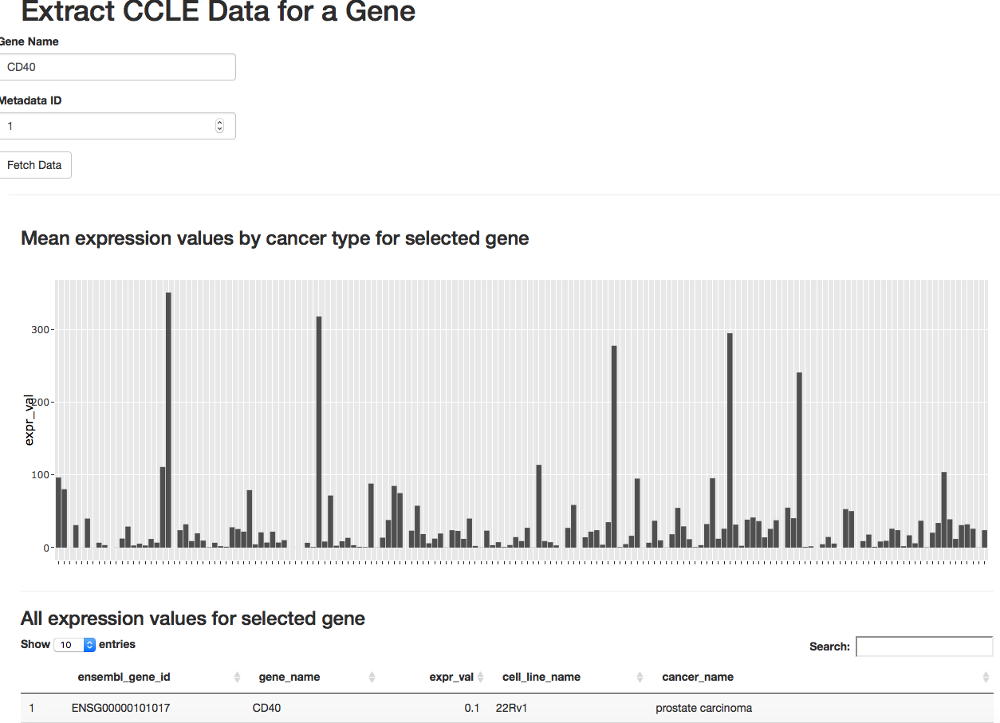

# PostgreSQLShiny

## Summary
I will develop a PostgreSQL--backed R Shiny application for visualization and analysis of [RNA gene expression](https://en.wikipedia.org/wiki/Gene_expression) data from the [Cancer Cell Line Encyclopedia](https://portals.broadinstitute.org/ccle)

## Steps in application development
1. Download the data.
2. Upload the data into a PostgreSQL database that I have named *Cancer_Cell_Line_Encyclopedia*.
3. Decompose the uploaded data into tables.
4. Write Pl/pgSQL functions to return the data as tables.
5. Write R code to call PL/pgSQL functions to return data frames.
5. Write the R code for the Shiny user interface.
6. Write some tests.

I realize that writing tests at the end is not the way it should be done but these notes are for learning and future reference.

## Download and explore the data
I downloaded the source data from the European Bioinformatics Institute Expression Atlas resource. The actual download files are listed [here](https://www.ebi.ac.uk/gxa/experiments/E-MTAB-2770/Downloads). 

I used the *wget* tool to download the source file.

```sh
wget https://www.ebi.ac.uk/gxa/experiments-content/E-MTAB-2770/resources/ExperimentDownloadSupplier.RnaSeqBaseline/tpms.tsv
```

At the time I downloaded this file, it contained 58,040 rows. It has four metadata lines that are identified by a hash, also known aa pound, character (#). The fifth line contains the column titles. I use a piped sequence of Unix text commands to examine this line like so:

```sh
head -5 tpms.tsv | tail -1 | tr '\t' '\n'  | cat -n
```

This sequence of commands does the following:
* Extract the first five lines (*head -5*).
* Extract the last of these lines (*tail -1*).
* Replace tabs with new lines (*tr '\t' '\n'*).
* Number the output lines (*cat -n*).

**Tip: These simple Unix text utilities can be combined using pipes to perform powerful data exploration prior to loading files into spreadsheets, R or databases. If you do not know them already, then I would recommend learning them.**

This gives me some useful information:
* There are 936 tab-separated columns in the file.
* The first two columns are gene identifiers.
* The remaining 934 columns contain the cell line identifiers and the cancer names they relate to.

All lines after line 5  are data lines.

## Upload the data file into a PostgreSQL database
I created a database called *Cancer_Cell_Line_Encyclopedia*. All the objects, tables, functions, etc, are stored in the default *public* schema. For more complex applications, I use multiple schemas but  for this rather simple example, one will suffice.

First, I log in to *psql* as shown below. This command assumes the port is the default 5432 and the password is set in the *.pgpass* file.

```sh
psql -d Cancer_Cell_Line_Encyclopedia -h <host name> -U <user name>
```

As described previously, the downloaded file is tab-delimited with a lot of columns (956 to be precise). I do the actual  parsing in PostgreSQL itself so the first step is to load the entire file into what I refer to as a transfer table. The target table definition is:

```sql
CREATE UNLOGGED TABLE transit_tmp(
    data_row TEXT
);
COMMENT ON TABLE transit_tmp
    IS 'Used to store unprocessed data before it is munged and moved to permanent tables.';
```

This table has only a single column and I have deliberately omitted the primary key. Since the data here is transitory, I've defined it as an *unlogged* table which makes it slightly more performant at the expense of persistence in the event of a system crash, see [this link](https://www.compose.com/articles/faster-performance-with-unlogged-tables-in-postgresql/) for more on this table type.

After logging in to the database with the *psql* client, I use a single *plsql \COPY* command to load the data into the *transit_tmp* table:

```sql
Cancer_Cell_Line_Encyclopedia=> \COPY transit_tmp FROM '<path to tpms.tsv file>' DELIMITER E'\b';
```

The delimiter **'\b'** was chosen because it does **not** exist in the file and, therefore, each full line is pushed into a single column called *data_row* in the target table *transit_tmp*. I tried using a Python's *psycopg2* to do this loading but it was very slow (>10 minutes). Assuming this *psqlp* command executes without error, I now have the data in Postgres and will proceed to do all further data processing in the database.

## Decompose the uploaded data into tables

Here are the steps:

1. Store the expression values, from column three onwards, as **PostgreSQL arrays**.
2. Record the **metadata** stored in the first four lines of the source file and prefixed with '#'.
3. Turn the fifth line that contains the column headings for the expression values into rows where each row contains the cell line name, the cancer name and the index number of the column that will be used later to retrieve the expression values from the array. Remember that PostgreSQL arrays are 1-based! 

Here are the table definitions (see the stored comments for table descriptions):

```sql
CREATE TABLE ccle_metadata(
  ccle_metadata_id SERIAL PRIMARY KEY,
  metadata TEXT);
COMMENT ON TABLE ccle_metadata IS 'Contains the metadata headings (lines with "#" prefix) for all CCLE data loaded into this database. Each metadata line is separated by a tab';

CREATE TABLE cell_line_cancer_type_idx_map(
  cell_line_cancer_type_idx_map_id SERIAL PRIMARY KEY,
  cell_line_name TEXT,
  cancer_name TEXT,
  expr_val_idx INTEGER,
  ccle_metadata_id INTEGER REFERENCES ccle_metadata(ccle_metadata_id));
COMMENT ON TABLE cell_line_cancer_type_idx_map IS 'Stores the cell line name and the cancer type it relates to with the index position (1-based) for the corresponding expression values stored in table "gene_expression_values".';

CREATE TABLE gene_expression_values(
  gene_expression_values_id SERIAL PRIMARY KEY,
  ensembl_gene_id TEXT,
  gene_name TEXT,
  expr_vals TEXT[],
  ccle_metadata_id INTEGER REFERENCES ccle_metadata(ccle_metadata_id)
);
COMMENT ON TABLE gene_expression_values IS 'Stores gene identifiers with their corresponding expression values that are stored as an array.';
CREATE UNIQUE INDEX gev_ensembl_gene_id_idx ON gene_expression_values(ensembl_gene_id);
```

Now that the tables are created, I will populate them using plain SQL. This SQL depends heavily on array manipulation. Remember that the input data is tab-separated so you will see a lot of string splitting using the the tab character (defined as E'\t' in the SQL statements).

### Storing the metadata

The following SQL turns the metadata rows into an array (*ARRAY_AGG*) and then concatenates the array elements into one big string (*ARRAY_TO_STRING*) that it then stores in the table.

```sql
INSERT INTO ccle_metadata(metadata)
SELECT
  ARRAY_TO_STRING(ARRAY_AGG(data_row), E'\t')
FROM
  transit_tmp
WHERE
  data_row ~ '^#';
```
Note the use of the regular expression *data_row ~ '^#'* to select the metadata lines!.


### Storing the cell line column names as rows

The SQL step here processes the line with the column names (line 5) and turns all its columns, except the first two that identify the genes, into rows. If you are not familiar with PostgreSQL arrays and the functions that generate and manipulate them, then the code will be challenging and you may need to refer to tutorials and references that describe functions such as *ARRAY_AGG*, *UNNEST*, *STRING_TO_ARRAY* and *ARRAY_TO_STRING*. It is easier to understand this quite complex nested *SELECT* SQL statement by breaking it down into its constituent parts starting with the inner-most *SELECT* named *sqi*. This *SELECT* extracts the fifth row (*OFFSET 4 LIMIT 1*) and uses the tab delimiter to break it into an array. The next *SELECT* named *sqo* turns the array into rows (*UNNEST*). It discards the first two rows (*OFFSET 2*), and then breaks each row into two parts: the cell line name (*cell_line_name*) and the cancer name (*cancer_name*)  using comma, **,**, as the delimiter. A complication here is that the comma character itself occurs once in some of the cancer names. The array slice *[2:3]* allows for this. The outer-most *SELECT* statement retrieves the generated values for the cell line and cancer names. It also adds two more columns: The first uses a window function *ROW_NUMBER* to generate index numbers that will be used to match the cell line and cancer names to the index for the array that will store the expression values in another table. The second value is *ccle_metadata_id*. Hard-coding it into the query like this is not a good idea but will do for this example. In fact, this whole SQL statement should be re-factored into one or more PL/pgSQL functions. 


```sql
INSERT INTO cell_line_cancer_type_idx_map(cell_line_name, cancer_name, expr_val_idx, ccle_metadata_id)
SELECT
  cell_line_name,
  cancer_name,
  CAST(ROW_NUMBER() OVER() AS INTEGER) expr_val_idx,
  1::INTEGER
FROM
  (SELECT
    (STRING_TO_ARRAY(UNNEST(colnames), ','))[1] cell_line_name,
    ARRAY_TO_STRING((STRING_TO_ARRAY(UNNEST(colnames), ','))[2:3], ',') cancer_name
  FROM
    (SELECT
      STRING_TO_ARRAY(data_row, E'\t') colnames
    FROM
      transit_tmp
    OFFSET 4 LIMIT 1) sqi
  OFFSET 2) sqo;
```

### Storing the gene expression values

The SQL statement to do this is considerable simpler than the previous one. The inner *SELECT* statement returns all data lines by using a regulary expression (*data_row ~ '^ENSG'*). The data rows are then turned into arrays by splitting on tabs as before and the required array elements are extracted and named. All the expression values are stored as an array (*[3:936]*). Once again, we have the hard-coded value for *1::INTEGER* for the *ccle_metadata_id* column.

```sql
INSERT INTO gene_expression_values(ensembl_gene_id, gene_name, expr_vals, ccle_metadata_id)
SELECT
  (STRING_TO_ARRAY(data_row, E'\t'))[1] ensembl_gene_id,
  (STRING_TO_ARRAY(data_row, E'\t'))[2] gene_name,
  (STRING_TO_ARRAY(data_row, E'\t'))[3:936] expr_vals,
  1::INTEGER
FROM
  (SELECT
    data_row
  FROM
    transit_tmp
  WHERE
    data_row ~ '^ENSG') sq;
```

## Write PL/pgSQL functions to return the data as tables

Now that the data is structured in tables, I need a way to extract data into a form that is usable in R. This requires turning the PostgreSQL expression value arrays into rows and matching these rows with the cancer and cell line types. I am interested in returning the expression data as a table for a given gene name. The example given here contains data for only one data set, TPMS, but I want to allow for storage of other data types so I need to filter so as to only return the expression data for one data set regardless of how many we have stored in the database. The value for *ccle_metadata_id* from the *ccle_metadata* table has been posted to the two other data tables as a foreign key for this very purpose (the ugly, hard-coded *1::INTEGER* value in the *INSERT* statements above). To return the table, I have defined a PL/pgSQL function that takes two parameters: the Ensembl gene ID and the *ccle_metadata_id*. Before I define this function, I need additional helper functions to determine if the expression values are numeric and a function to return the Ensembl IDs for a given gene name. Some of the expression values in the input file are *null*. When I split on tabs to create the arrays, these are represented as empty strings. And no, empty strings are not NULL despite what Oracle thinks. I want to ensure that these empty strings are returned as true NULLs in the output table. The following Boolean-returning function does the numeric test:

```plpgsql
CREATE OR REPLACE FUNCTION isnumeric(text) RETURNS BOOLEAN AS $$
DECLARE x NUMERIC;
BEGIN
    x = $1::NUMERIC;
    RETURN TRUE;
EXCEPTION WHEN others THEN
    RETURN FALSE;
END;
$$
STRICT
LANGUAGE plpgsql IMMUTABLE;
COMMENT ON FUNCTION isnumeric(text) IS $qq$ Purpose: Check if the given argument is a number. Used to check substrings created by splitting strings into arrays. Copied verbatim from this source: http://stackoverflow.com/questions/16195986/isnumeric-with-postgresql. $qq$;
```

The second helper function is needed because there are multiple entries for some gene names, that is, the same gene name can map to one or more Ensembl gene IDs. I am not going to explain why this is so but it is a complication that needs to be accountd for. Since gene names are much more user-friendly than the Ensembl gene IDs, I need a function to return all Ensembl gene iDs for a given gene name. Here is the function:

```plpgsql
CREATE OR REPLACE FUNCTION get_ensembl_gene_ids_for_gene_name(p_gene_name TEXT)
RETURNS TABLE (ensembl_gene_id TEXT)
AS
$$
DECLARE
  l_gene_name TEXT := TRIM(UPPER(p_gene_name));
BEGIN
  RETURN QUERY
  SELECT
    gev.ensembl_gene_id
  FROM
    gene_expression_values gev
  WHERE
    gene_name = l_gene_name;
END;
$$
LANGUAGE plpgsql SECURITY DEFINER STABLE;
 
COMMENT ON FUNCTION get_ensembl_gene_ids_for_gene_name(TEXT) IS
$qq$
Purpose: Return all Ensembl gene IDs for a given gene name from table "gene_expression_values". 
Leading/trailing white space and case are ignored.
Note: Gene names are not unique in table "gene_expression_values" but Ensembl gene IDs are.
This function will return all the Ensembl IDs for a given gene name.
Examples: SELECT ensembl_gene_id FROM get_ensembl_gene_ids_for_gene_name('clec2d');
SELECT ensembl_gene_id FROM get_ensembl_gene_ids_for_gene_name('mal2') -- Returns two Ensembl gene IDs
$qq$;
```

Now I can define the main function that will return a **table** of expression values for all cell lines and cancer types for a given Ensembl gene ID and metadata ID. Here it is:

```plpgsql
CREATE OR REPLACE FUNCTION get_expr_vals_for_ensembl_gene_id_dataset(p_ensembl_gene_id TEXT, p_ccle_metadata_id INTEGER)
RETURNS TABLE(ensembl_gene_id TEXT, gene_name TEXT, expr_val REAL, cell_line_name TEXT, cancer_name TEXT)
AS
$$
BEGIN
  RETURN QUERY
  SELECT
    sqo.ensembl_gene_id,
    sqo.gene_name,
    CASE 
      WHEN isnumeric(sqo.expr_val) THEN CAST(sqo.expr_val AS REAL)
      WHEN LENGTH(TRIM(sqo.expr_val)) < 1 THEN 0::REAL
      ELSE NULL
    END expr_val,
    clctim.cell_line_name,
  clctim.cancer_name
  FROM
    (SELECT
      sqi.ensembl_gene_id,
      sqi.gene_name,
      sqi.expr_val,
      ROW_NUMBER() OVER() expr_val_idx
    FROM
      (SELECT
        gev.ensembl_gene_id,
        gev.gene_name,
        UNNEST(gev.expr_vals) expr_val
      FROM
        gene_expression_values gev
      WHERE
        gev.ensembl_gene_id = p_ensembl_gene_id) sqi) sqo
    JOIN
      cell_line_cancer_type_idx_map clctim ON sqo.expr_val_idx = clctim.expr_val_idx
  WHERE
    clctim.ccle_metadata_id = p_ccle_metadata_id;
END;
$$
LANGUAGE plpgsql SECURITY DEFINER STABLE;
COMMENT ON FUNCTION get_expr_vals_for_ensembl_gene_id_dataset(TEXT, INTEGER) IS
$qq$
Summary: Returns a table of CCLE expression values and their corresponding gene, cell line name and cancer type values for a given ensembl gene ID and metadata ID. Empty values are converted to 0's (confirmed with the data provider).
Example: SELECT * FROM get_expr_vals_for_ensembl_gene_id_dataset('ENSG00000004468', 1);
$qq$
```

I can test this function from the command line as follows:

```sh
psql -h <your host name> -d Cancer_Cell_Line_Encyclopedia  -U <your user name> -A -F $'\t' -X -t -c "SELECT * FROM get_expr_vals_for_ensembl_gene_id_dataset('ENSG00000004468', 1)" -o ENSG00000004468_ccle_expression.tsv
```
The command given above generates a tab-separated file with each expression value and its associated gene and cancer name and cancer line details in a separate row.

This PL/pgSQL function is really just one large SQL statement containing nested *SELECT* sub-statements. The PL/pgSQL provides a wrapper around the SQL to handle parameters and to return the table generated by the SQL. Since this is the main PL/pgSQL function of the application, it merits some explanation. Like the *SELECT* statements used earlier to populate tables, it uses nested queries, array manipulation and a window function. The inner-most *SELECT* named *sqi* turns the expression arrays into rows. The next statement named *sqo* uses the window function *ROW_NUMER* to add row numbers (*ROW_NUMBER() OVER() expr_val_idx*) to its output. These generated row numbers are then used to join the expression values to their corresponding cancer cell line name and cancer name values (*JOIN cell_line_cancer_type_idx_map clctim ON sqo.expr_val_idx = clctim.expr_val_idx*). The *isnumeric* helper function defined earlier is used to cast numeric strings to REAL and empty strings to zeros. Originally, I treated empty strings as NULLs but after consultation, these empty values were conformed to be very low/undetectable signal so assigning them to zero makes sense.

## Write R code to call PL/pgSQL functions to return data frames

Now, finally, I can write some R code to call the PL/pgSQL functions defined earlier. To do this, I created an R project in R Studio. This is going to be an R Shiny application but that does not matter for now. I added a file called *global.R* to the project. This will be used by the R Shiny application files, *ui.R* and *server.R*, that I will create later.


```r
library(pool)
library(DBI)

# Create the pool object for connecting to the database
pool <- pool::dbPool(
  drv = RPostgreSQL::PostgreSQL(),
  dbname = "Cancer_Cell_Line_Encyclopedia",
  host = "<host name>",
  user = "shiny_reader",
  port = 5432,
  password = "readonly"
)
# Connect to the database
pg_conn <- poolCheckout(pool)

# Return a dataframe with a single column containing all the Ensembl IDs linked to the given
#  gene name. The returned data frame will usually hold a single Ensembl ID but for genes such
#  MAL2, multiple Ensembl IDs will be returned.
get_ensembl_gene_ids_for_gene_name <- function(gene_name) {
  sql_tmpl <- 'SELECT ensembl_gene_id FROM get_ensembl_gene_ids_for_gene_name(?gene_name)'
  sql <- sqlInterpolate(DBI::ANSI(), sql_tmpl, gene_name = gene_name)
  ensembl_gene_ids <- dbGetQuery(pg_conn, sql)
}

# Returns a data frame with all the columns defined in the PL/pgSQL function "get_expr_vals_for_ensembl_gene_id_dataset"
#  for the given gene name and metadata ID.
# If the given gene name has more than one associated Ensembl gene ID, then rows are returned for all the Ensembl gene IDs.
# The user will then have to filter the resulting data frame for the Ensembl gene ID of interest.
get_expr_vals_for_gene_name <- function(gene_name, ccle_metadata_id) {
  ensembl_gene_ids <- get_ensembl_gene_ids_for_gene_name(gene_name)
  sql_tmpl <- 'SELECT ensembl_gene_id, gene_name, expr_val, cell_line_name, cancer_name FROM    get_expr_vals_for_ensembl_gene_id_dataset(?ensembl_gene_id, ?ccle_metadata_id)'
  expr_vals_for_gene_name <- data.frame()
  for (ensembl_gene_id in ensembl_gene_ids$ensembl_gene_id) {
    sql <- sqlInterpolate(DBI::ANSI(), sql_tmpl, ensembl_gene_id = ensembl_gene_id, ccle_metadata_id = ccle_metadata_id)
    expr_vals_for_ensembl_gene_id <- dbGetQuery(pg_conn, sql)
    expr_vals_for_gene_name <- rbind(expr_vals_for_gene_name, expr_vals_for_ensembl_gene_id)
  }
  return(expr_vals_for_gene_name)
}
```

I installed the *pool* package to manage the database connection. It greatly simplifies the whole process and ensures that connections are re-used and cleaned up as required. I learned about the *pool* package by reading this [RStudio article](https://shiny.rstudio.com/articles/pool-basics.html). I created a read-only account in PostgreSQL called *shiny_reader* and set the PL/pgSQL functions to be readable to this account by adding the *SECURITY DEFINER* clause to the end of the function definitions. R users can thereby extract data from the database but cannot make any changes and cannot modify or view the underlying tables. Essentially, I want a one-way data flow from the database to the R client so that I so not have to worry about data data integrity or transactions. Although all the database interaction is mediated by a read-only account, I have also used the *DBI sqlInterpolate* function to pass parameters to the SQL statements. It is good practice to use this type of mechanism in any client language to prevent SQL injection. SQL injection and its prevention in R is well described in [this article](Links: https://shiny.rstudio.com/articles/sql-injections.html).

If I source the *global.R* file shown above in an R Studio session, I can test the function *get_expr_vals_for_gene_name* to as follows:

```r
expr_vals_for_gene_name <- get_expr_vals_for_gene_name('il2ra', 1)
```

I can then view the resulting data frame and manipulate it in whatevr manner I wish. However, to turn this into an application that I can share with end users, I need to turn it into a Shiny application.

## Write the R code for the Shiny user interface
Very basic R Shiny application:

```r
# ui.R
library(shiny)
library(DT)
library(plotly)

shinyUI(fluidPage(
  # Application title
  headerPanel(
    "Extract CCLE Data for a Gene"
  ),
  
  fluidRow(
    textInput("gene_name", "Gene Name"),
    numericInput('ccle_metadata_id', 'Metadata ID', value = 1),
    actionButton("get_data", "Fetch Data")
  ),
  hr(),
  mainPanel(h3("Mean expression values by cancer type for selected gene"),
            plotlyOutput("ccle_plot"),
            hr(),
            h3("All expression values for selected gene"),
            DT::dataTableOutput("result"))
  
))

# server.R
shinyServer(function(input, output) {
  expr_vals_for_gene_name <- eventReactive(input$get_data, {
      get_expr_vals_for_gene_name(input$gene_name, input$ccle_metadata_id)
    })
  output$ccle_plot <- renderPlotly(ggplot(expr_vals_for_gene_name(), 
                                        aes(x=factor(cancer_name), 
                                            y=expr_val)) 
                                 + theme(axis.title.x=element_blank(),
                                         axis.text.x=element_blank())
                                 + stat_summary(fun.y="mean", geom="bar"))
  output$result <- DT::renderDataTable(expr_vals_for_gene_name())
})
```
When I run the Shiny app and enter a gene name, I see the following:




This is a very basic, but functional, Shiny application. I will return to this page to describe the R code in more detail
